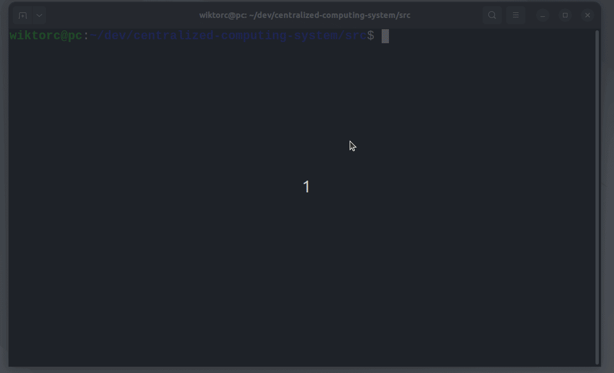
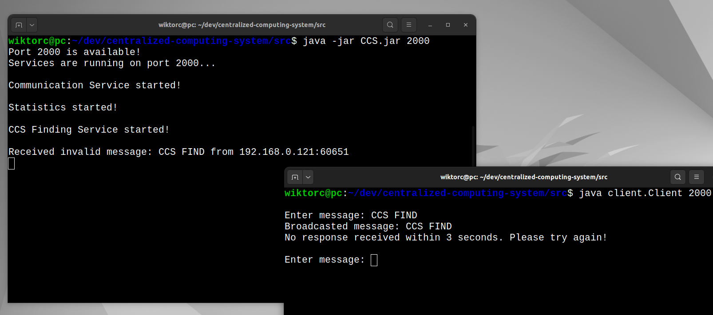
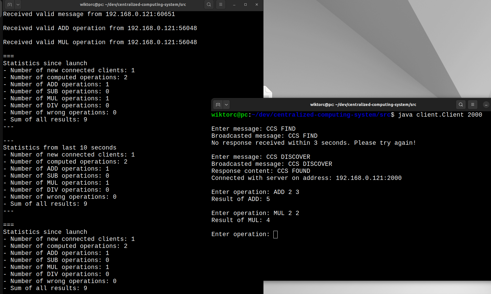
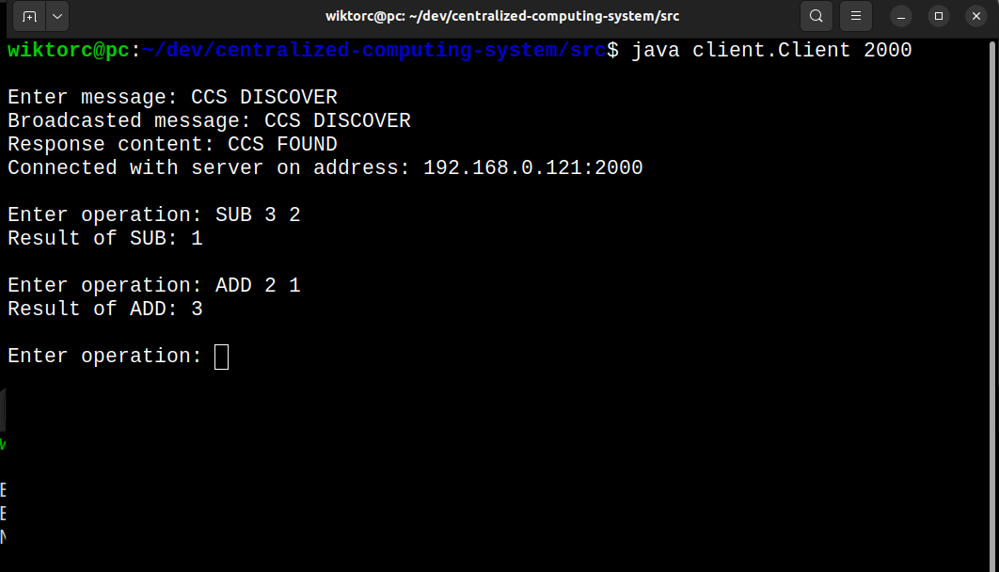
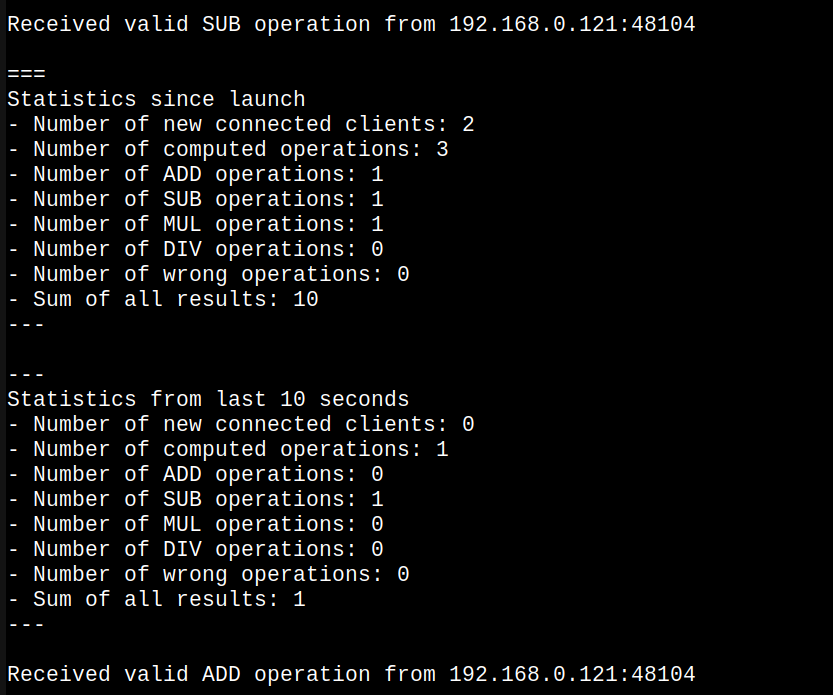
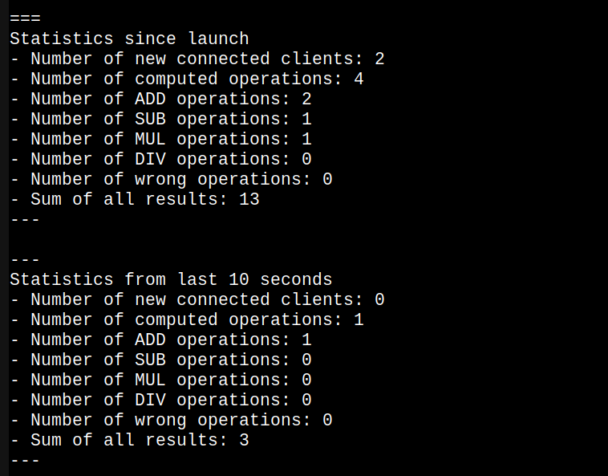
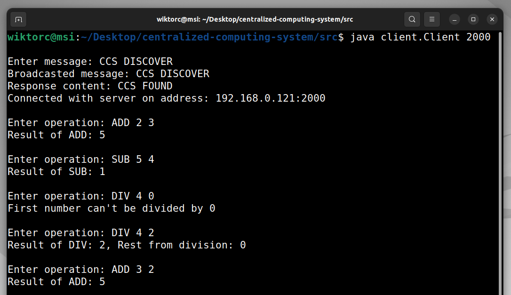
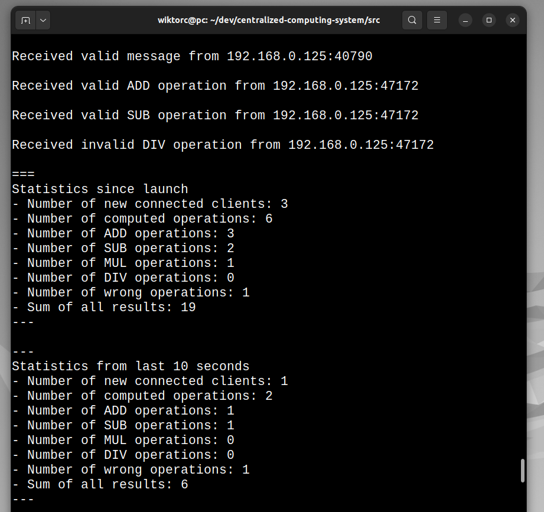
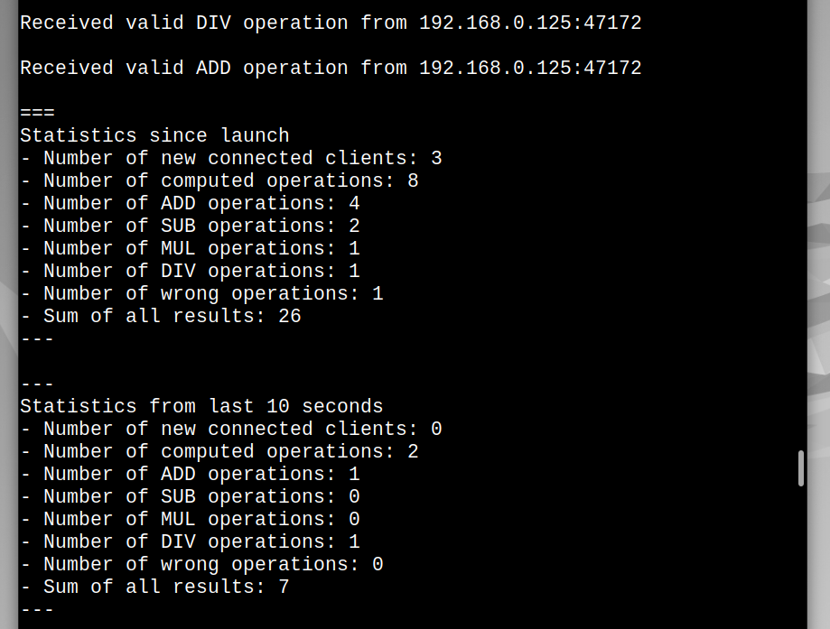

# 💻 Centralized Computing System

## 👀 About

Centralized Computing System (CCS) is a Java-based server application created to facilitate the detection of its service in a local network, perform arithmetic operations for connected clients and provide statistical reports on its activity. The application operates using both the UDP and TCP protocols to handle different functionalities. The goal of project is to create a robust and efficient server capable of managing multiple clients simultaneously and providing real-time statistics about various operations.

## 📋 How the application works

### General

The application consists of, among others, a program implementing the CCS (Centralized Computing System) started with the command:
```bash
java -jar CCS.jar <port>
```
where ```<port>``` is a number specifying the UDP/TCP port number.  Application shares three main functionalities, which run on multiple threads:

- CCS Finding Service,
- Communication Service,
- Statistics Service.

### CCS Finding Service

After the application has been launched successfully by entering the valid port, UDP port with the number set by the ```<port>``` parameter opens.  Listening on this port for messages begins. Server interprets as correct only these messages, which starts with ```CCS DISCOVER```. After receiving such message server sends response, which contains ```CCS DISCOVER``` content and returns to listening. After receiving incorrect message server doesn't send any message. It only displays a log about the received incorrect message. This is intentional, because by sending any response the client is able to get the server's IP address from the response and connect to it. If client sends incorrect message, the connection should not occur.

### Communication Service

After the application has been launched, TCP port with the number set by the ```<port>``` parameter opens. Listening on this port for clients connections begins. After establishing the connection, server starts client service. This service consists of:

- Receiving commands from client. Command is single row, which have format: ```<OPER> <NUM1> <NUM2>```.
	- ```<OPER>``` represents one of available operations performed on integers. Client can choose from: ```ADD```, ```SUB```, ```MUL```, ```DIV```.
	- ```<NUM1>``` and ```<NUM2>``` are integers, which are arguments for the selected operation.
- Calculating result according to given operation and values.
- Sending response to client, which contains result or message describing an error in received operation.
- Logging a message about received operation and its result on the screen.
- Storing data for statistics.
- Back to waiting for the next client command.

### Statistics Service

While working with clients, the server collects global statistics. Server logs statistics cyclically every 10 seconds. since the start of application and statistics from the last 10 seconds of activity.

- Number of new connected clients,
- Number of calculated operations,
- Number of specific operations,
- Number of incorrect operations,
- Sum of results.

### Client

Source code of Java-based client is also attached. Client is started with command:

```bash
java Client <port>
```

where ```<port>``` is a number of port, to which client will send messages.  

After client has been launched successfully, firstly user is asked for the content of message. This content will be attached to the UDP broadcast packet, which will be sent in local network to the port number specified earlier. Then it is waiting for a response from server. If response is not delivered within 3 seconds, it mean, that message was incorrect  and timeout occurs. Then client can make another attempt in the same way.

After sending correct message to the server and receiving correct response, client is utilizing TCP protocol to connect to the server, which works on machine with IP address gathered from response and on the same port like this used to find CCS. From this moment client can send to the server requests containing operations and listen to responses.

## 🔧 Tech Stack

- Java 8

## ▶️ Run
Clone repository

```bash
git clone git@github.com:P4ZD4N/centralized-computing-system.git
```

Navigate to the repository

```bash
cd /path/to/centralized-computing-system/src
```

Compile server classes

```bash
javac *.java
```

If you want to use client you should also compile client class

```bash
javac client/Client.java
```

Create JAR file

```bash
jar cfm CCS.jar manifest.txt *.class
```

Run server

```bash
java -jar CCS.jar <port>
```

Run client

```bash
java client.Client <port>
```


## 📺 Demo

GIF below presents compilation of server app, client and way to create JAR file.


On the screen below, firstly I launched server with proper command. Port 2000 was available so server started successfully. We can see, that all services was also started, each on different thread. Then I runned launched client and sent wrong message to the server. Server received this message (what is confirmed by log), but didn't send response. Client has timed out and asks for the next message.


Now I entered correct message (which starts with CCS DISCOVER) and client has connected with the server. It is confirmed in the first server log, which you can see on screen below. Client sent two operations: ADD 2 3 and MUL 2 2. Server received these operations. Then calculated and sent correct results. Server saved these operations and displayed it in statistics.


Second client has been started. Client connected with server without obstacles and sent two another operations: SUB 3 2 and ADD 2 1. It shows, that server can handle many clients connected at the same time.


Image below presents server logs after sending operations from second client. We can see, that server received them and now number of new connected clients since launch is equal 2.


Statistics updated after receiving second operation from second client: ADD 2 1


Now third client has been started (on different machine!). As you can see it is no problem for server. Client has connected with server properly and sent a couple of operations.


Let's go back and see, whether server logs match. And everything indicates that yes!


